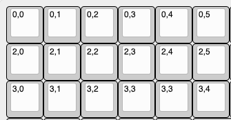

> This guide assumes you have the QMK CLI installed and have forked your own [qmk-vial](https://github.com/vial-kb/vial-qmk) repository.

## 0. Environment

### Windows

You will have QMK MSYS installed. What you need to do is point MSYS to your Vial fork rather than the QMK one. You can use `qmk setup -H <YOUR PATH HERE>` to do this. For example: `qmk setup -H /d/Code/vial-qmk`. It doesn't like the colons, but the path will be correct when you hit enter.

### Mac

Install the QMK CLI tools, then inside your IDE or Terminal of choice: Point QMK to your Vial fork rather than the QMK one. You can use `qmk setup -H <YOUR PATH HERE>` to do this. For example: `qmk setup -H /d/Code/vial-qmk`.

## 1. Create new keyboard

I opt for opening the `vial-qmk` folder in VS Code and then using the terminal there, you can do as you please.

To make a new keyboard, you can use `qmk new-keyboard`, this will as you for a keyboard name. this can be whatever you want, but its good practice to put all your builds under a named folder. Most go for their GitHub usename. I will call this example `fleetline`, so for the name I put `lukevanlukevan/fleetline`.

Then it will ask a few things around names and usernames, fairly self explanatory.

When you get to the base layout question, this is where it can really help you. For this example, I selected `ortho_4x12`. The reason this is helpful is you'll get a few pre generated files that will make the whole process a bit faster.

Next is "What powers your project?" mine is a ProMicro, so I select that. If you are unsure, there are many places to find out. Googling your microcontroller will yeild answers.

## 2. Building the matrix

If you have already build the board and just want to create a firmware for it, or if you're pre-planning, it's now time to build the layout in [Keyboard Layout Editor](http://www.keyboard-layout-editor.com/#/). Since I am building an ortho 4x12, I will click "Preset" at the top left and select "Planck".

If you need to build your layout, do so now.

Now it is time to assign the matrix values to the keys. Click on the "Tools" tab and remove all legends. This step is crucial for Vial to know how to relate the real world position of our keys to the matrix position. For each key, write in the top left legend slot: `X,Y`. These values correlate to the row number and column number of the switch in the matrix.



Now that you have the matrix setup, go to the keymaps folder for you board and duplicate the default folder. Rename this to `vial`. With QMK (and Vial) all of the parent files like `config.h` etc. can be overuled if they exist in the keymap folder. In this case, I will duplicate the files `config.h` and `rules.mk`.

Now, in the `vial` keymap folder, make a new file called `vial.json`. In here, the standard format is:

```json
{
	"matrix": {
		"rows": 4,
		"cols": 12
	},
	"layouts": {
		"keymap": [
			//your matrix here
		]
	}
}
```

Adjust the rows and cols to suit your build. Hop back to KLE and go to the raw data tab

`python3 util/vial_generate_keyboard_uid.py`

