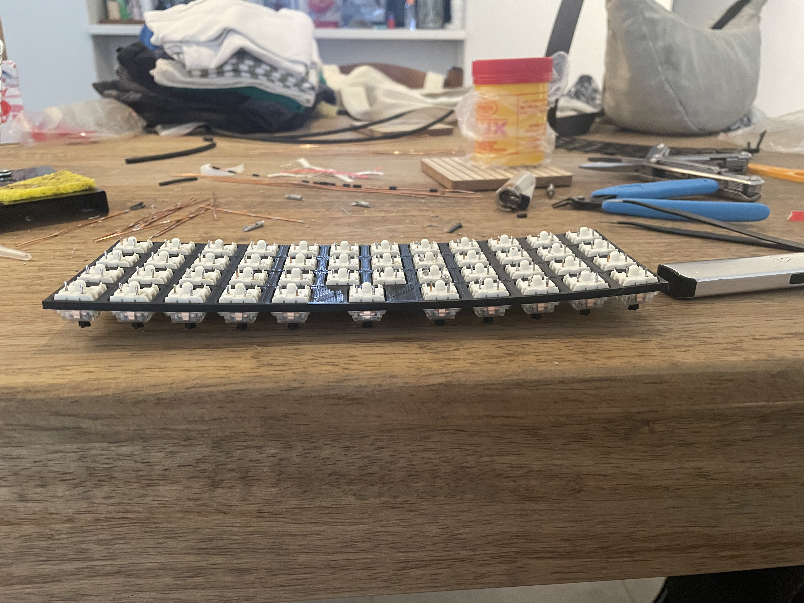
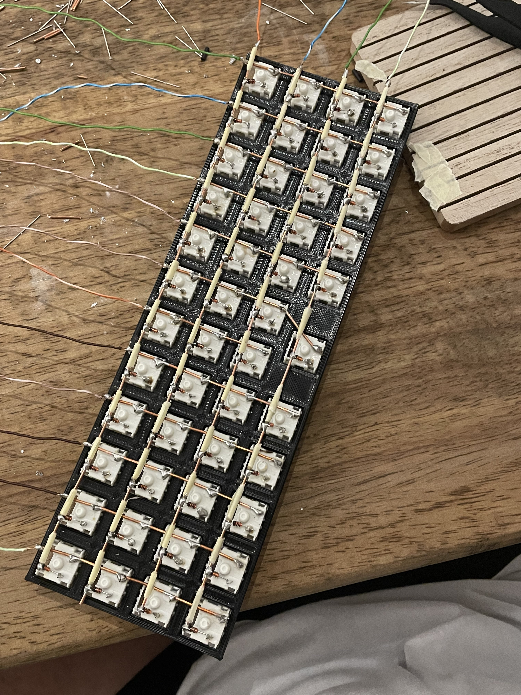
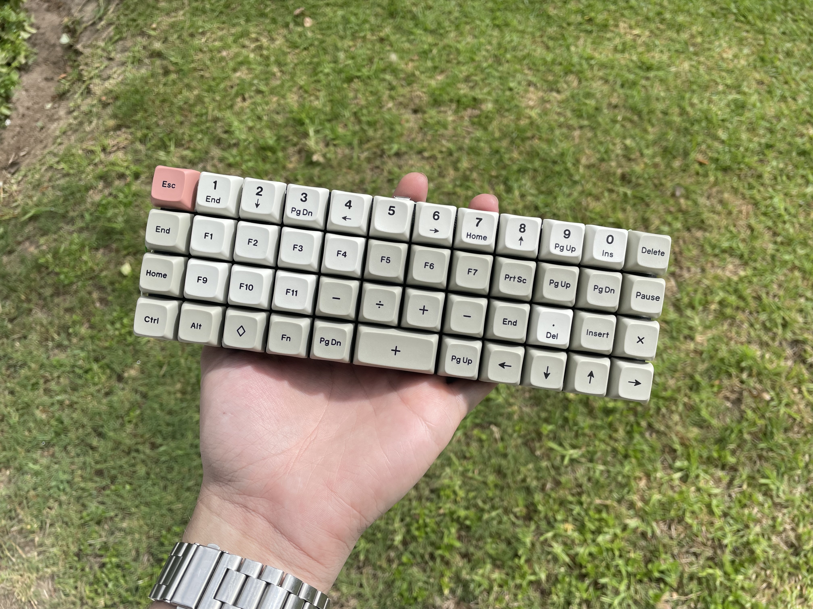

Now that I have made something that works, it was time to make something actually usuable (foreshadowing...). Having always wanted a Planck, I thought it would be a fun idea to make that.

## Materials

Learning that the stripped ethernet wasnt going to take me very far, I popped down to the hardware store and picked up some random wire from the rollers with a core made of 7 strands of copper wire. I got about 2mm.

I also got some 2.4mm to 1mm heat shrink which was way to large for the copper I was using so it sucked, but it was the smallest they had.

## Plate

Using the classic [Joe Scotto](https://www.github.com/joe-scotto) inspired plate style again here. I grabbed my layout from Keyboard Layout Editor, imported it into Plasticity and extruded. This was the first time I considered a problem that popped up with the LV16: Bowing.

Knowing this, I added some horizontal expansion to make the switch holes a bit looser and stop the bowing. Keep reading...

## Soldering

I popped all the switches in, and this was a cool moment for me, the first truly usable keyboard starting to come together.

Having done this, I noticed I was still suffering from the bowing. Something to remember for the next build, and a case will help pull it all flat again.

First time with the thicker copper wire, immediately felt way cleaner and way easier to work with. I did the columns, then got started on the diodes. This time I did more research and did the loop thing to hook around the switch posts which made life easier.

After doing all the rows, I whipped out the heat shrink tubing and realized it wasnt going to cut it. With ants in my pants I opted to use some masking tape that I had within arms reach. I wouldnt recommend it but it did work.

Wow, ortho 4x12, feeling very clean and rather proud of myself!

## Firmware

Now running my own Vial fork and having watched many more videos to understand this stuff, I created a new keyboard with the very imaginative name: "LV47"

Still not having wrapped my head around the matrix shenanigans, I ended up with the same reversed columns issue again.

Not much going on, but you can find the [firmware here](https://www.github.com/lukevanlukevan/vial-qmk/tree/vial/keyboards/lukevanlukevan/lv16).

Feeling very chuffed, I knew I couldnt use this at work just yet, so I took off all the normal keycaps so that I still had my main keyboard and stuck all my extras on here. It looks terrible and needs a case, but hey, I made it!

