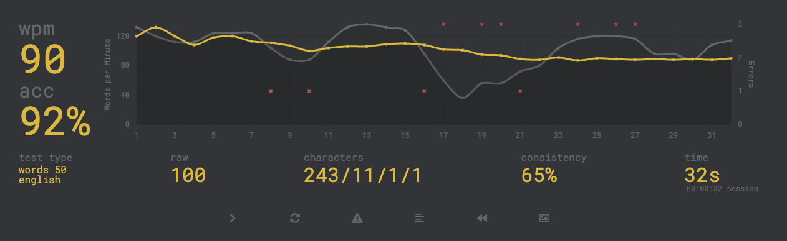
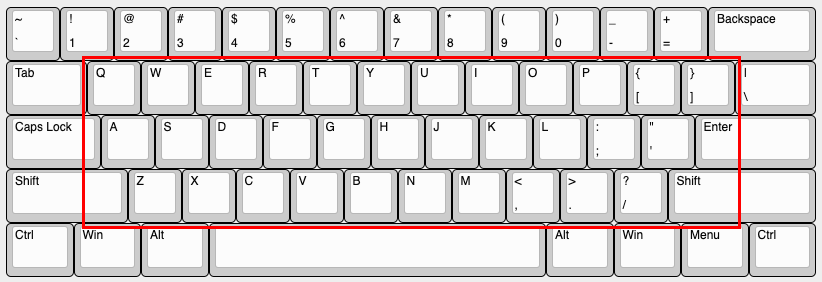
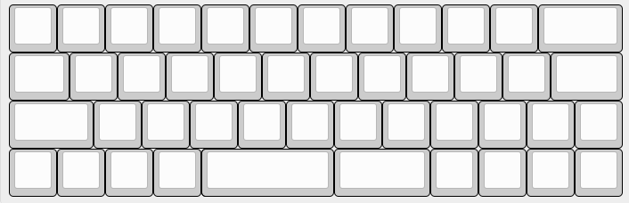

Having tried the unreadable Planck for a week, I realized the grass is always greener. The keyboard I wanted to try for so long was not for me, and I couldn't get above 30wpm on it, compared to my much more reasonable 90ish.

I loved the idea of the tiny form factor, and really like the feeling of the bottom row and all the keys there for layers and chording. Now I looked around at some other 40% boards and found the "Minivan." Quite fitting, seeing as my surname is Van, but wanted to adjust it to make it my own and to warrant giving it a new name. Basic premise is that it its a 60% with the bits you know and love in the right spot, but having some more fun with all the non-letter keys.

After having more of a play in KLE, I ended up a row 4 of 4x 1u keys, then a split space using 2.75u key and then a 2u key, then another 4x 1u keys. This gave me the best of both worlds, with the same muscle memory for typing, an inverted T nav cluster, a split space just for fun, and 2x 1u keys on either side of the space bars for layer swaps.

## Plate

Using the [Joe Scotto](https://www.github.com/joe-scotto) plate again. I grabbed my layout from Keyboard Layout Editor, imported it into Plasticity and extruded. This time, trying my best to avoid the bowing, I doubled my horizontal offset in my slicer, which was way too much. My switches ended up fine in some spots and loose in others. If I like this board, I will redo it so it can really work for me. I didnt take a picture of the printed plate, but the screenshot above should give you enough of an understanding.

## Soldering

I started doing my columns and immediately realized rowstag is a very strange thing to work with, especially with the cramped bottom row I chose. After a bit of bending, I got all my rows and columns set up, with a particularly strange column on the bottom left.

## Firmware

Armed with my new knowledge of how the matrix works, I defined my columns the correct way and everything went smoothly. There was one little bit having to skip columns here and there, but it did not take long to get sorted out.

You can find the [firmware here](https://www.github.com/lukevanlukevan/vial-qmk/tree/vial/keyboards/lukevanlukevan/vandura).

I basically gutted the Planck build to make this, as I didn't have any other switches, and I have a few sets of caps in the mail, but this is the final result with the leftover keys in the meantime.

I left long leads to the controller as im not exactly sure if where I will route it in the case.

Seeing as I actually added something to this, I chose the name Vandura, as I will probably just stick to naming these after iconic vans :P

